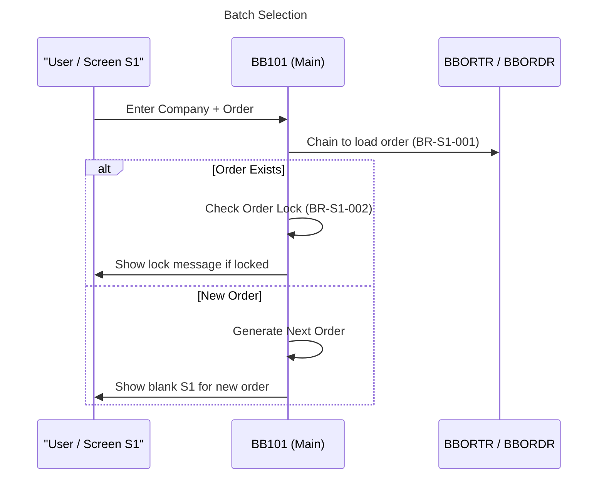

```mermaid
---
title: Batch Selection
---
sequenceDiagram
    participant User as "User / Screen S1"
    participant BB101 as BB101 (Main)
    participant Files as BBORTR / BBORDR

    User->>BB101: Enter Company + Order# or create new
    BB101->>Files: Chain to load order (BR-S1-001)
    alt Order Exists
        BB101->>BB101: Check Order Lock (BR-S1-002)
        BB101->>User: Show lock message if locked
    else New Order
        BB101->>BB101: Generate Next Order# (BR-S1-003)
        BB101->>User: Show blank S1 for new order
    end
```