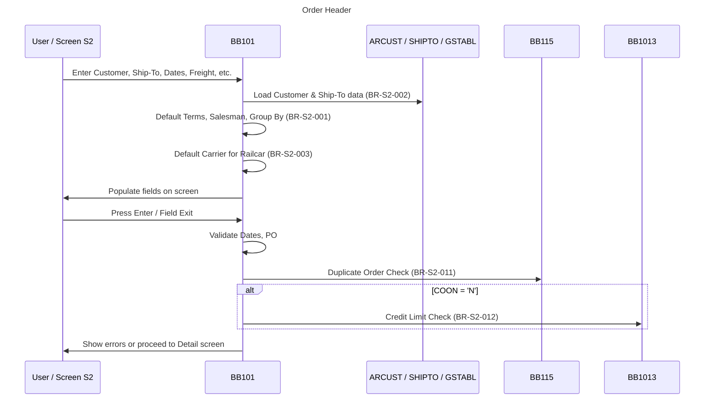

```mermaid
---
title: Order Header
---

sequenceDiagram
    participant User as User / Screen S2
    participant BB101 as BB101
    participant Masters as ARCUST / SHIPTO / GSTABL
    participant BB115 as BB115
    participant BB1013 as BB1013

    User->>BB101: Enter Customer, Ship-To, Dates, Freight, etc.
    BB101->>Masters: Load Customer & Ship-To data (BR-S2-002)
    BB101->>BB101: Default Terms, Salesman, Group By (BR-S2-001)
    BB101->>BB101: Default Carrier for Railcar (BR-S2-003)
    BB101->>User: Populate fields on screen

    User->>BB101: Press Enter / Field Exit
    BB101->>BB101: Validate Dates, PO#, Area/Loc, Incoterms, Freight (BR-S2-005 to BR-S2-010)
    BB101->>BB115: Duplicate Order Check (BR-S2-011)
    alt COON = 'N'
        BB101->>BB1013: Credit Limit Check (BR-S2-012)
    end
    BB101->>User: Show errors or proceed to Detail screen


```