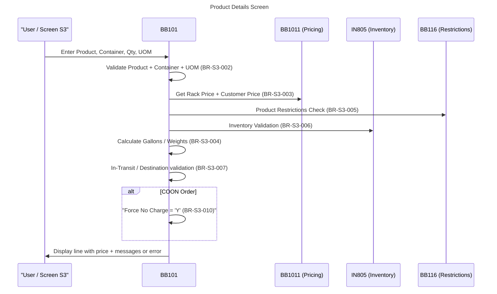

```mermaid
---
title: Product Details Screen
---
sequenceDiagram
    participant User as "User / Screen S3"
    participant BB101 as BB101
    participant BB1011 as BB1011 (Pricing)
    participant IN805 as IN805 (Inventory)
    participant BB116 as BB116 (Restrictions)

    User->>BB101: Enter Product, Container, Qty, UOM
    BB101->>BB101: Validate Product + Container + UOM (BR-S3-002)
    BB101->>BB1011: Get Rack Price + Customer Price (BR-S3-003)
    BB101->>BB116: Product Restrictions Check (BR-S3-005)
    BB101->>IN805: Inventory Validation (BR-S3-006)
    BB101->>BB101: Calculate Gallons / Weights (BR-S3-004)
    BB101->>BB101: In-Transit / Destination validation (BR-S3-007)
    alt COON Order
        BB101->>BB101: "Force No Charge = 'Y' (BR-S3-010)"
    end
    BB101->>User: Display line with price + messages or error
```