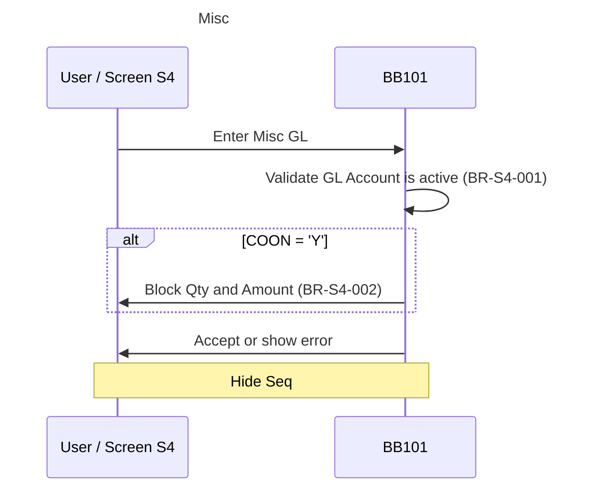

```mermaid
---
title: Misc
---
sequenceDiagram
    participant User as User / Screen S4
    participant BB101 as BB101

    User->>BB101: Enter Misc GL#, Amount, Type
    BB101->>BB101: Validate GL Account is active (BR-S4-001)
    alt COON = 'Y'
        BB101->>User: Block Qty and Amount (BR-S4-002)
    end
    BB101->>User: Accept or show error
    Note over BB101,User: Hide Seq# 940+ (BR-S4-003)


```