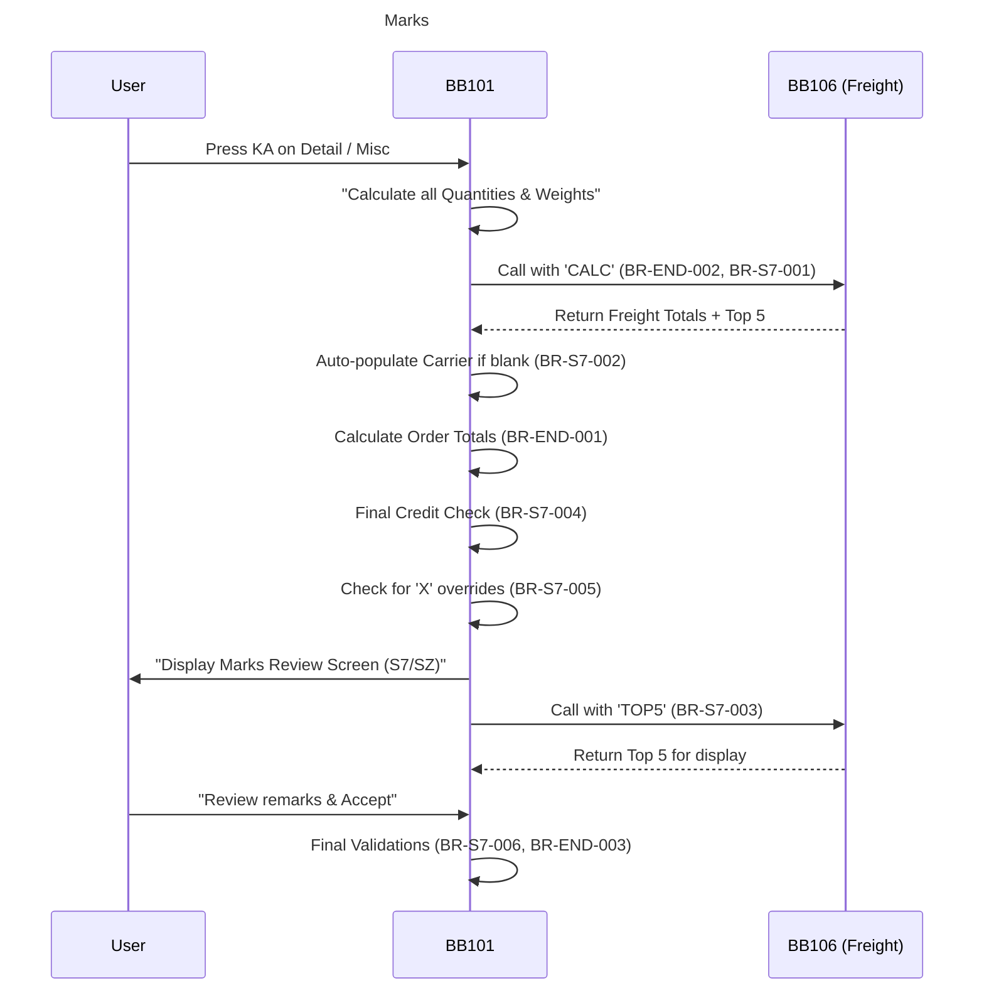

```mermaid
---
title: Marks
---
sequenceDiagram
    participant User as User
    participant BB101 as BB101
    participant BB106 as BB106 (Freight)

    User->>BB101: Press KA on Detail / Misc
    BB101->>BB101: "Calculate all Quantities & Weights"
    BB101->>BB106: Call with 'CALC' (BR-END-002, BR-S7-001)
    BB106-->>BB101: Return Freight Totals + Top 5
    BB101->>BB101: Auto-populate Carrier if blank (BR-S7-002)
    BB101->>BB101: Calculate Order Totals (BR-END-001)
    BB101->>BB101: Final Credit Check (BR-S7-004)
    BB101->>BB101: Check for 'X' overrides (BR-S7-005)

    BB101->>User: "Display Marks Review Screen (S7/SZ)"
    BB101->>BB106: Call with 'TOP5' (BR-S7-003)
    BB106-->>BB101: Return Top 5 for display
    User->>BB101: "Review remarks & Accept"
    BB101->>BB101: Final Validations (BR-S7-006, BR-END-003)
```