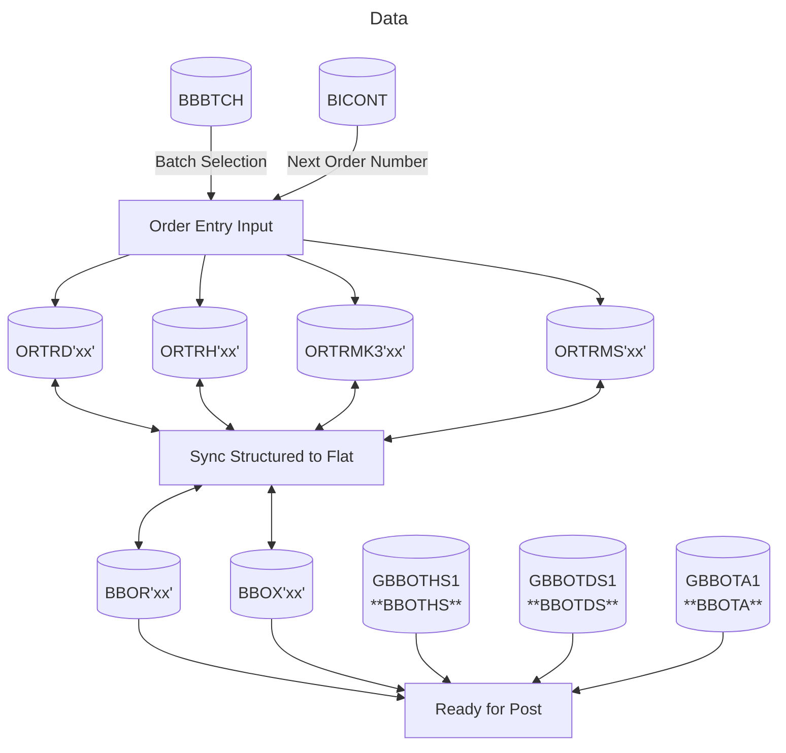

```mermaid
---
title: Data
---

graph TD

    %%Input Tables
    BICONT[(BICONT)]
    BBBTCH[(BBBTCH)]
    BBOR[(BBOR'xx')]
    BBOX[(BBOX'xx')]
    GBBOTHS1[(GBBOTHS1<br>**BBOTHS**)] 
    GBBOTDS1[(GBBOTDS1<br>**BBOTDS**)]   
    GBBOTA1[(GBBOTA1<br>**BBOTA**)]
   
    %% Structured Files
    ORTRD[(ORTRD'xx')]
    ORTRH[(ORTRH'xx')]
    ORTRMK3[(ORTRMK3'xx')]
    ORTRMS[(ORTRMS'xx')]
    
    %%Nodes
    BATCH[Order Entry Input]
    SYNC[Sync Structured to Flat]
    POST[Ready for Post]
    %%Step1
    BBBTCH-->|Batch Selection|BATCH
    BICONT-->|Next Order Number|BATCH
    BATCH-->ORTRD<-->SYNC
    BATCH-->ORTRH<-->SYNC
    BATCH-->ORTRMK3<-->SYNC
    BATCH-->ORTRMS<-->SYNC

    %%Step2
    SYNC<-->BBOR
    SYNC<-->BBOX

    BBOR-->POST
    BBOX-->POST
    GBBOTHS1-->POST
    GBBOTDS1-->POST
    GBBOTA1-->POST


   


```