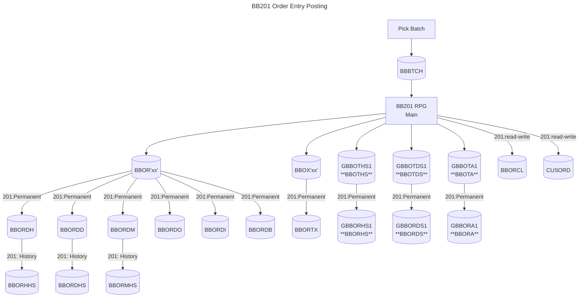

```mermaid
---
title: BB201 Order Entry Posting
---

graph TD
    %% Define Tables
    SCREEN[Pick Batch]

    CK[BB201 RPG <br>Main]
    BBBTCH[(BBBTCH)]
    SCREEN-->BBBTCH
    BBBTCH-->CK
    

    %%Input Tables
    BBOR[(BBOR'xx')]
    BBOX[(BBOX'xx')]
    GBBOTHS1[(GBBOTHS1<br>**BBOTHS**)] 
    GBBOTDS1[(GBBOTDS1<br>**BBOTDS**)]   
    GBBOTA1[(GBBOTA1<br>**BBOTA**)]
   

    %% Permanant Tables
    BBORDH[(BBORDH)]
    BBORDD[(BBORDD)]
    BBORDM[(BBORDM)]
    BBORDO[(BBORDO)]
    BBORDI[(BBORDI)]
    BBORDB[(BBORDB)]
    BBORTX[(BBORTX)]
    BBORCL[(BBORCL)]
    CUSORD[(CUSORD<br>)]

    GBBORHS1[(GBBORHS1<br>**BBORHS**)]
    GBBORDS1[(GBBORDS1<br>**BBORDS**)]
    GBBORA1[(GBBORA1<br>**BBORA**)]


    %%Batch Selection
    CK-->BBOR
    CK-->BBOX
    CK-->GBBOTHS1[(GBBOTHS1<br>**BBOTHS**)]
    CK-->GBBOTA1
    CK-->GBBOTDS1[(GBBOTDS1<br>**BBOTDS**)]
    CK-->|201:read-write|BBORCL
    CK -->|201:read-write|CUSORD


    %% History Tables
    BBORHHS[(BBORHHS)]
    BBORDHS[(BBORDHS)]
    BBORMHS[(BBORMHS)]


    %%Input to Permanant
   

    GBBOTHS1-->|201:Permanent|GBBORHS1
    GBBOTDS1-->|201:Permanent|GBBORDS1
    GBBOTA1--> |201:Permanent|GBBORA1
    

    %% Move to Permenant
    BBOR-->|201:Permanent|BBORDH
    BBOR-->|201:Permanent|BBORDD
    BBOR-->|201:Permanent|BBORDM
    BBOR-->|201:Permanent|BBORDO
    BBOR-->|201:Permanent|BBORDI
    BBOR-->|201:Permanent|BBORDB
    BBOX-->|201:Permanent|BBORTX

   


    %% History Tacking
    BBORDH -->|201: History|BBORHHS
    BBORDD -->|201: History|BBORDHS
    BBORDM -->|201: History|BBORMHS
    


```