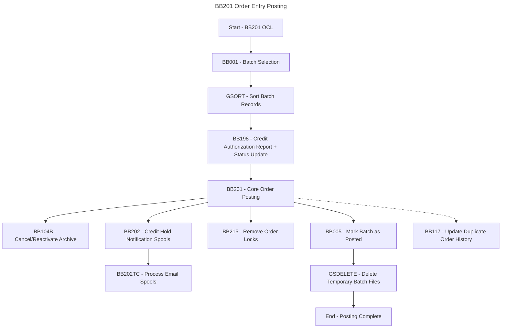

```mermaid
---
title: BB201 Order Entry Posting
---

flowchart TD
    Start[Start - BB201 OCL]--> BB001[BB001 - Batch Selection]

    BB001--> GSORT[GSORT - Sort Batch Records]

    GSORT--> BB198[BB198 - Credit Authorization Report + Status Update]

    BB198--> BB201[BB201 - Core Order Posting]

    BB201--> BB104B[BB104B - Cancel/Reactivate Archive]

    BB201--> BB202[BB202 - Credit Hold Notification Spools]

    BB202--> BB202TC[BB202TC - Process Email Spools]

    BB201--> BB215[BB215 - Remove Order Locks]

    BB201--> BB005[BB005 - Mark Batch as Posted]

    BB005--> GSDELETE[GSDELETE - Delete Temporary Batch Files]

    GSDELETE--> End[End - Posting Complete]

    %% Additional internal call
    BB201 -.-> BB117[BB117 - Update Duplicate Order History]


```