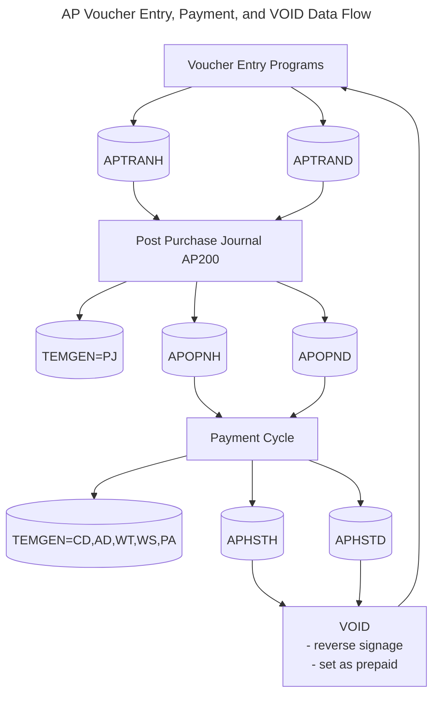

```mermaid
---
title:
   AP Voucher Entry, Payment, and VOID Data Flow
---
flowchart  TD
 
Entry[Voucher Entry Programs]
PJ[Post Purchase Journal AP200]
Payment[Payment Cycle]
VOID[VOID <br> - reverse signage <br> - set as prepaid]
APTRANH[(APTRANH)]
APTRAND[(APTRAND)]
TEMGEN1[(TEMGEN=PJ)]
APOPNH[(APOPNH)]
APOPND[(APOPND)]
TEMGEN2[(TEMGEN=CD,AD,WT,WS,PA)]
APHSTH[(APHSTH)]
APHSTD[(APHSTD)]


Entry-->APTRANH
Entry-->APTRAND
APTRANH-->PJ
APTRAND-->PJ
PJ-->TEMGEN1
PJ-->APOPNH
PJ-->APOPND
APOPNH-->Payment
APOPND-->Payment
Payment-->TEMGEN2
Payment-->APHSTH
Payment-->APHSTD

APHSTH-->VOID-->Entry
APHSTD-->VOID
```