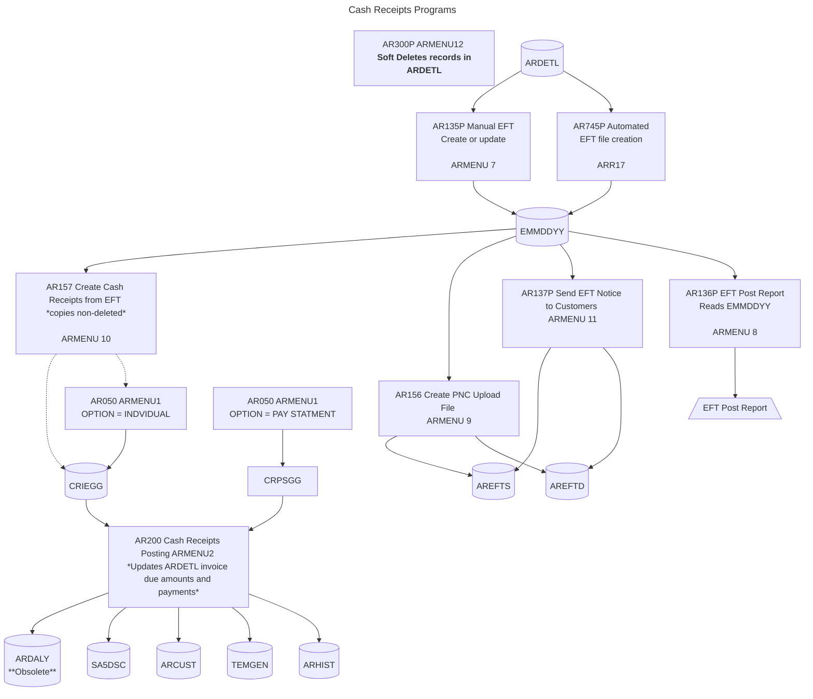

Below is a table that lists the programs from the provided call stack (`AR200.ocl36.txt`, `AR200P.ocl36.txt`, `AR200P.rpgle.txt`, `AR200.rpg36.txt`, `AR210.rpg36.txt`, `AR211.rpg36.txt`, `AR2011.ocl36.txt`, `AR2011.rpg36.txt`) as rows and the tables (files) used as columns. At each intersection, a brief description indicates how the program modifies or creates/writes to the table. Empty cells indicate the program does not interact with the table. The table is generated based on the file specifications and logic described in each program.

<xaiArtifact artifact_id="e89ebd71-fb79-459c-9913-de1336e7c822" artifact_version_id="b3a7a83f-0665-4933-b4bf-b9e9886d8704" title="ProgramTableInteraction.md" contentType="text/markdown">

| **Program** | **CRIEGG** | **CRPSGG** | **CRTRGG** | **CRDIGG** | **CRTGGG** | **AR211S** | **ARCUST** | **ARDETL** | **ARCONT** | **ARHIST** | **GLMAST** | **TEMGEN** | **ARDALY** | **SA5FIND** | **GSTABL** | **SA5DSC** | **REPORT** | **REPORTP** |
|-------------|------------|------------|------------|------------|------------|------------|------------|------------|------------|------------|------------|------------|------------|-------------|------------|------------|------------|-------------|
| **AR200.ocl36.txt** | Reads transaction input | Reads transaction input | Creates sorted transaction file | Creates GL distribution file | Creates GL journal entries | Creates sorted GL entries | Reads customer data | | Reads control data | | | | | | | | Routes transaction register | Routes paperless transaction register |
| **AR200P.ocl36.txt** | Checks existence | Checks existence | | | | | | | Reads control data | | | | | | | | | |
| **AR200P.rpgle.txt** | Checks existence | Checks existence | | | | | | | Reads control data | | | | | | | | | |
| **AR200.rpg36.txt** | | | Reads transactions | Writes GL distribution entries | | | Updates balances, payment dates | Updates invoice amounts, payments | Reads control data, updates journal numbers | Writes audit trail | | | | | | | Writes transaction register | Writes paperless transaction register |
| **AR210.rpg36.txt** | | | | Reads distribution entries | Writes GL journal entries | | | | Reads control data (GL accounts) | | | | | | | | | |
| **AR211.rpg36.txt** | | | | | Reads GL journal entries | Reads sorted GL entries | | | Reads control data (GL accounts) | | Reads account descriptions | Writes GL postings | Writes daily AR summaries | | | | Writes sales/cash journals | Writes paperless sales/cash journals |
| **AR2011.ocl36.txt** | | | Reads transactions | | | | Reads customer data | | Reads control data | | | | | Reads invoice line items | Reads product/discount codes | Reads for discount processing | | |
| **AR2011.rpg36.txt** | | | Reads transactions | | | | Reads customer data | | | | | | | Reads invoice line items | Reads product/discount codes | Writes product-level discount details | | |

</xaiArtifact>

### Notes
- **Programs**: Listed in the order provided: `AR200.ocl36.txt`, `AR200P.ocl36.txt`, `AR200P.rpgle.txt`, `AR200.rpg36.txt`, `AR210.rpg36.txt`, `AR211.rpg36.txt`, `AR2011.ocl36.txt`, `AR2011.rpg36.txt`.
- **Tables**: Include all files referenced across the programs: `CRIEGG`, `CRPSGG`, `CRTRGG` (?9?CRTRGG), `CRDIGG` (?9?CRDIGG), `CRTGGG` (?9?CRTGGG), `AR211S` (?9?AR211S), `ARCUST` (?9?ARCUST), `ARDETL` (?9?ARDETL), `ARCONT` (?9?ARCONT), `ARHIST` (?9?ARHIST), `GLMAST` (?9?GLMAST), `TEMGEN` (?9?TEMGEN), `ARDALY` (?9?ARDALY), `SA5FIND` (?9?SA5FIND), `GSTABL` (?9?GSTABL), `SA5DSC` (?9?SA5DSC), `REPORT`, `REPORTP`.
- **Interactions**:
  - **Read**: File is used as input without modification (e.g., `ARCONT` for control data).
  - **Update**: File is modified in place (e.g., `ARDETL` invoice amounts, `ARCUST` balances).
  - **Write**: File is created or appended with new records (e.g., `SA5DSC` discount details).
  - **Create**: File is generated by the program (e.g., `CRTRGG` by `AR200.ocl36.txt`).
  - **Route**: Reports are sent to output queues (e.g., `ARPOST`, `TESTOUTQ`).
- **Assumptions**: `AR200P.ocl36.txt` and `AR200P.rpgle.txt` do not modify files directly but facilitate initialization. `AR211` does not update `ARCONT` (per 8/06/14 change). File labels use `?9?` prefix (e.g., `GG` for Atrium).

