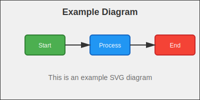

# Image Usage Examples

This page demonstrates how to embed and reference images in your MkDocs documentation.

## Basic Image Syntax

The standard Markdown syntax for images is:

```markdown

```

## Image Paths

Images should be placed in the `docs/images/` directory. Paths are relative to the markdown file location.

### From Root of docs/

If your markdown file is in `docs/`, reference images like this:

```markdown


```

### From Subdirectories

If your markdown file is in a subdirectory like `docs/accounts-payable/`, use relative paths:

```markdown

```

Or use absolute paths from the docs root:

```markdown

```

## Image Organization

Recommended directory structure:

```
docs/
  images/
    diagrams/          # Flowcharts, architecture diagrams
    screenshots/       # Application screenshots
    icons/            # Small icons and logos
    logos/            # Company/product logos
```

## Examples

### Live Example

Here's an actual image rendered in this documentation:



This SVG diagram demonstrates how images appear in your documentation. SVG format is ideal for diagrams as it scales perfectly at any size.

### Inline Images

Images can be placed inline with text:

Here is a diagram showing the process: 

### Standalone Images

Images can be displayed on their own line:


### Images with Titles

You can add titles using HTML:

```html

```

Example with title:


### Responsive Images

For responsive images that scale properly:

```html

```

Example of responsive image:


## Supported Image Formats

MkDocs supports common image formats:

- PNG (`.png`) - Best for screenshots and diagrams with text
- JPEG/JPG (`.jpg`, `.jpeg`) - Best for photographs
- GIF (`.gif`) - For animated images
- SVG (`.svg`) - Vector graphics, scales perfectly
- WebP (`.webp`) - Modern format with good compression

## Best Practices

1. **File Naming**: Use descriptive, lowercase filenames with hyphens:
   - ✅ `order-processing-flow.png`
   - ❌ `IMG_1234.PNG`

2. **Alt Text**: Always provide meaningful alt text for accessibility:
   - ✅ ``
   - ❌ ``

3. **File Size**: Optimize images to keep file sizes reasonable (< 1MB when possible)

4. **Organization**: Group related images in subdirectories

5. **Version Control**: Commit images to git rather than hosting externally

## Linking Images

You can make images clickable by wrapping them in a link:

```markdown
[](images/diagrams/large-diagram.png)
```

## Image Alignment

Using HTML, you can align images:

```html
<p align="center">
  
</p>
```

Example of centered image:

<p align="center">
  
</p>

