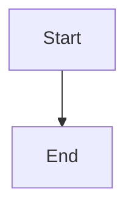

# Examples

This directory contains example files demonstrating how to use Mermaid charts and images in your MkDocs documentation.

## Files

- **[mermaid-examples.md](mermaid-examples.md)** - Comprehensive examples of various Mermaid diagram types
- **[image-examples.md](image-examples.md)** - Guide for embedding and organizing images

## Quick Start

### Adding a Mermaid Diagram

Use triple backticks with `mermaid` language identifier:

````markdown

````

### Adding an Image

Place images in `docs/images/` and reference them:

```markdown

```

## Directory Structure

```
docs/
├── images/
│   ├── diagrams/      # Flowcharts, architecture diagrams
│   └── screenshots/   # Application screenshots
└── examples/
    ├── README.md
    ├── mermaid-examples.md
    └── image-examples.md
```

## Need Help?

- Check the [Mermaid documentation](https://mermaid.js.org/) for diagram syntax
- Review the example files in this directory
- Refer to the [MkDocs Material documentation](https://squidfunk.github.io/mkdocs-material/) for advanced features

