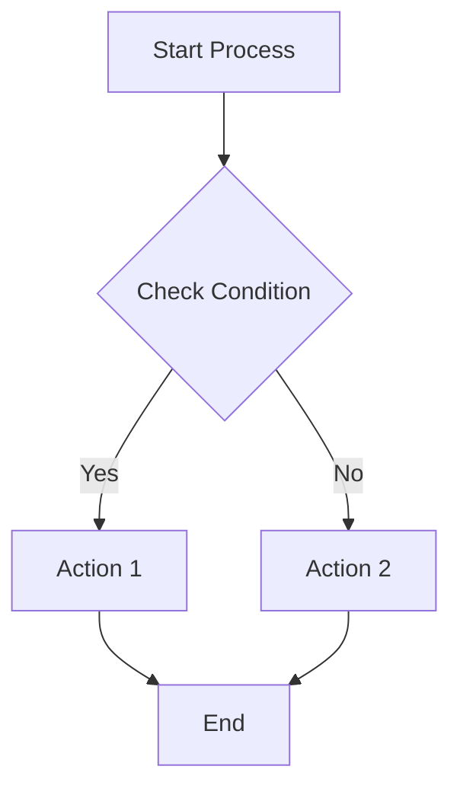
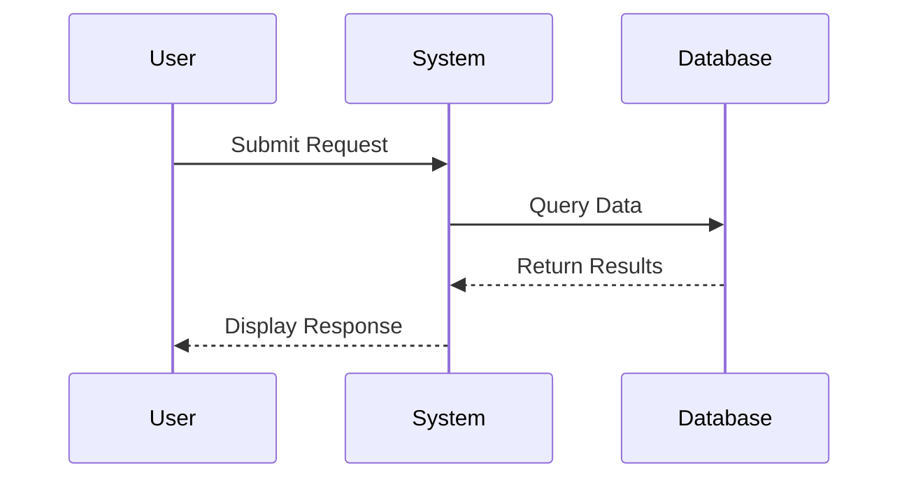
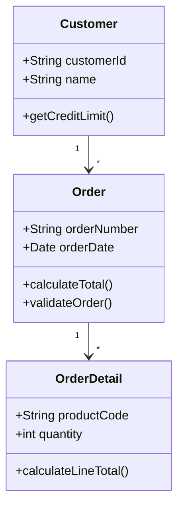
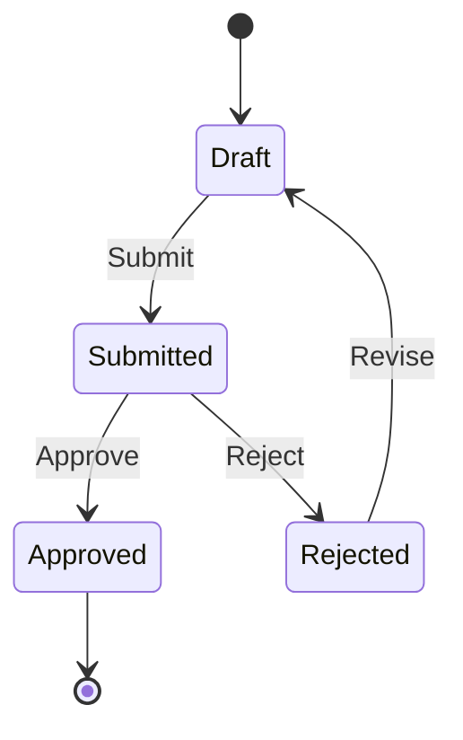
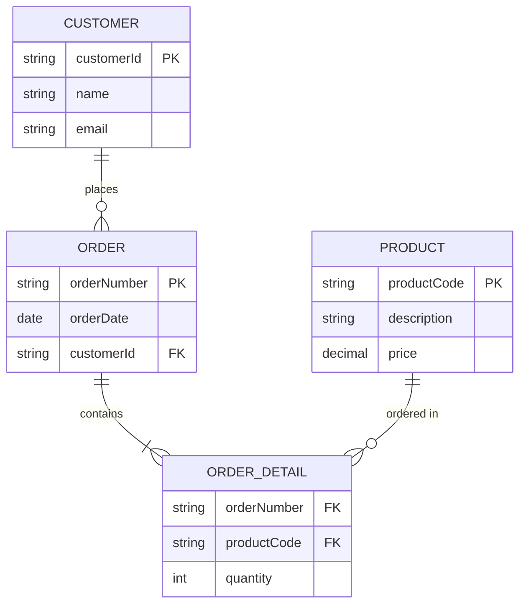
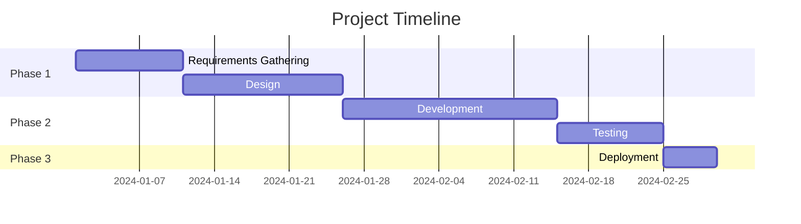
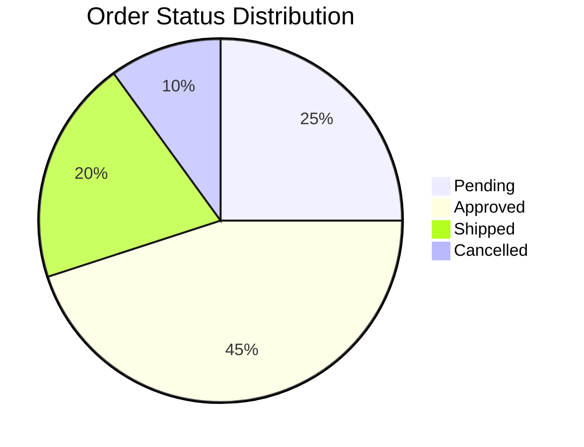

# Mermaid Chart Examples

This page demonstrates various types of Mermaid diagrams that you can use in your documentation.

## Flowchart Diagrams

Flowcharts are great for showing processes and decision flows:



## Sequence Diagrams

Sequence diagrams show interactions between different components:



## Class Diagrams

Class diagrams illustrate object-oriented relationships:



## State Diagrams

State diagrams show state transitions:



## Entity Relationship Diagrams

ER diagrams show database relationships:



## Gantt Charts

Gantt charts show project timelines:



## Pie Charts

Pie charts show proportional data:



## Git Graph

Git graphs show version control branches:

```mermaid
gitgraph
    commit id: "Initial"
    branch develop
    checkout develop
    commit id: "Feature A"
    commit id: "Feature B"
    checkout main
    merge develop
    commit id: "Release 1.0"
```

## Tips for Using Mermaid

1. **Syntax**: Always use triple backticks with `mermaid` language identifier
2. **Node IDs**: Use camelCase or underscores for node IDs (no spaces)
3. **Labels**: Wrap labels with special characters in quotes
4. **Testing**: Preview your diagrams locally before committing
5. **Complexity**: Keep diagrams simple and focused for better readability

